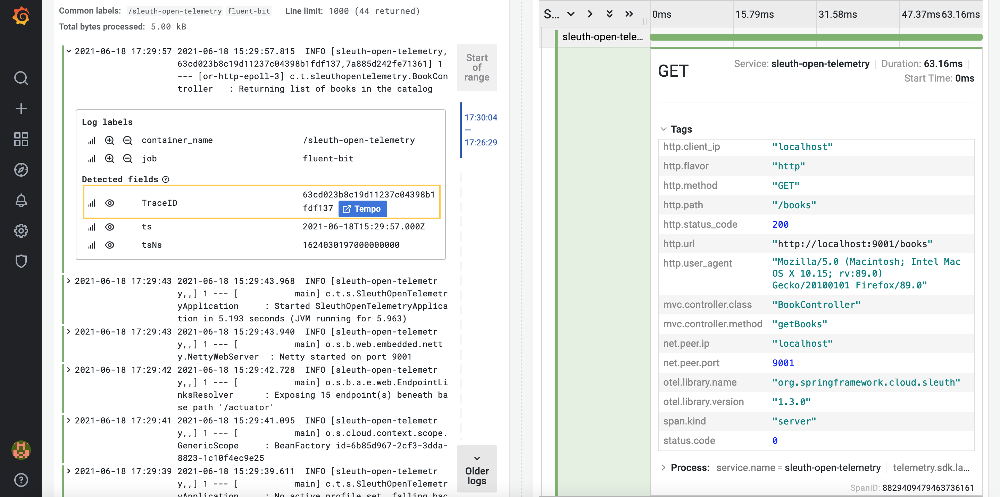

# Spring Cloud Sleuth OTel

This example demonstrates the usage of Spring Cloud Sleuth OTel for enabling distributed tracing support based
on OpenTelemetry in a Spring Boot application. The traces are exported through OTLP and stored in Grafana Tempo.

## Usage

You can use Docker Compose to run both the application and the Grafana observability stack.

First, package the Sping Boot application as a container image leveraging the Cloud Native Buildpacks integration
provided by Spring Boot.

```bash
./gradlew bootBuildImage
```

Then, from the project root folder, run Docker Compose.

```bash
docker-compose up -d
```

The application is exposed through port 9001. Send a GET request to the `/books` endpoint
and check the application logs for trace and span identifiers.

```bash
http :9001/books
```

Then, open Grafana at http://localhost:9000 (`admin`/`password`), go to the "Explore" page, select "Loki" as the data source
and fetch logs from the Spring Boot application with the following query:

```bash
{container_name="/sleuth-open-telemetry"}
```

Expand the log message produced by the `/books` endpoint. The trace id is shown with a "Tempo" link that will
open up a panel from Tempo and show the full trace.



## Observability Stack

The Spring Boot application is observable, as any cloud native application should. Prometheus metrics are exposed
thanks to the Spring Boot Actuator library. Distributed tracing is enabled through Spring Cloud Sleuth OTel.

**Grafana** lets you query and visualize logs, metrics, and traces from your applications. After running
the Docker Compose configuration as explained in the previous section, you can access Grafana on port 3000.
It provides already dashboards to visualize metrics from Spring Boot.
In the "Explore" panel, you can query logs from Loki, metrics from Prometheus, and traces from Tempo.

**Fluent Bit** collects logs from all containers and forwards them to Loki.

**Loki** is a log aggregation system part of the Grafana observability stack. "It's like Prometheus, but for logs."
Logs are available for inspecting from Grafana.

**Tempo** is a distributed tracing backend part of the Grafana observability stack. Spring Boot applications sends
traces to Tempo following the OpenTelemetry specification. Traces are available for inspecting from Grafana.

**Prometheus** is a monitoring system part of the Grafana observability stack. It parses the metrics endpoints
exposed by Spring Boot applications (`/actuator/prometheus`). Metrics are available for inspecting
and visualization from Grafana.
